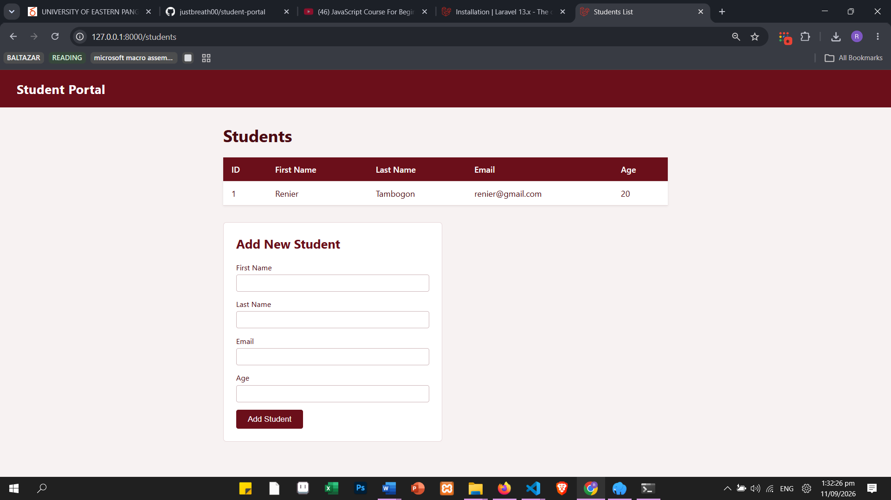

<div align="center">

# Student Portal

### A Laravel-based student management system built for Systems Integration and Architecture

A simple academic project focused on implementing **MVC architecture, database integration, routing, controllers, models, migrations, and Blade views** using Laravel.

<br>


</div>

---

## About

**Student Portal** is a simple student management application created as part of **Systems Integration and Architecture (SIA)**.

The project focuses on understanding how the different components of a Laravel application work together, from database migrations and Eloquent models to controllers, routes, and Blade views.

The current implementation allows student records to be viewed and added through the application.


---

## Screenshot





---

## Database Schema

### `students`

| Column       | Type      | Constraints       |
| ------------ | --------- | ----------------- |
| `id`         | BIGINT    | Primary Key       |
| `firstname`  | VARCHAR   | Required          |
| `lastname`   | VARCHAR   | Required          |
| `email`      | VARCHAR   | Required, Unique  |
| `age`        | INTEGER   | Required          |
| `created_at` | TIMESTAMP | Laravel Timestamp |

---

## Routes

| Method | Route            | Controller                | Purpose               |
| ------ | ---------------- | ------------------------- | --------------------- |
| GET    | `/students`      | `StudentController@index` | List all students     |
| GET    | `/students/{id}` | `StudentController@show`  | View a single student |
| POST   | `/students`      | `StudentController@store` | Store a new student   |

---

## Project Structure

```text
student-portal/
│
├── app/
│   ├── Http/
│   │   └── Controllers/
│   │       └── StudentController.php
│   │
│   └── Models/
│       └── Student.php
│
├── database/
│   ├── migrations/
│   │   └── create_students_table.php
│   │
│   └── database.sqlite
│
├── resources/
│   └── views/
│       │ 
│       ├──  Layouts/
│       │    └── app.blade.php
│       │ 
│       └──  Students/
│            └── index.blade.php
│
├── routes/
│   └── web.php
│
└── README.md
```


---


## Developer

**Jhon Renier Tambogon**

BSIT Student
University of Eastern Pangasinan

Built for **Systems Integration and Architecture.
